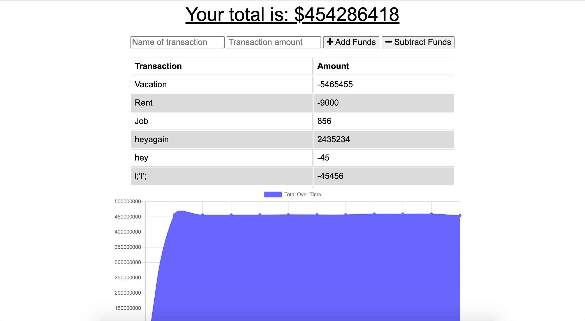

# Budget Tracker

An app intended to give users a fast and easy way to track their money online and offline. Users are able to add expenses and deposits to their to their budget when offline and when they are back online, their app is updated.

**Link to GitHub Repo:** https://github.com/rachealcolbert/budget-tracker

**Link to Heroku Deployed App:** https://budget-tracker324.herokuapp.com/

## Description

GIVEN a budget tracker without an internet connection
WHEN the user inputs an expense or deposit
THEN they will receive a notification that they have added an expense or deposit
WHEN the user reestablishes an internet connection
THEN the deposits or expenses added while they were offline are added to their transaction history and their totals are updated

## Credits

The creator of this project's email and GitHub is below.

- [GitHub](https://github.com/rachealcolbert)
- rachealcolbert16@gmail.com

## Contributing

No contributions are needed on this project.
